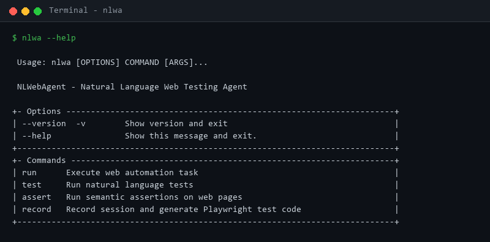
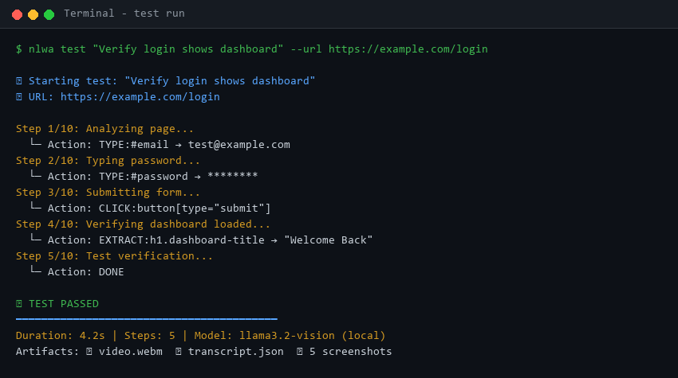
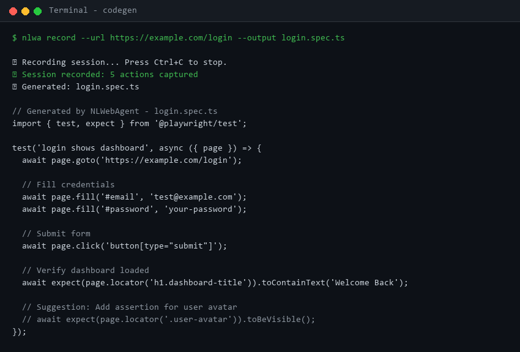
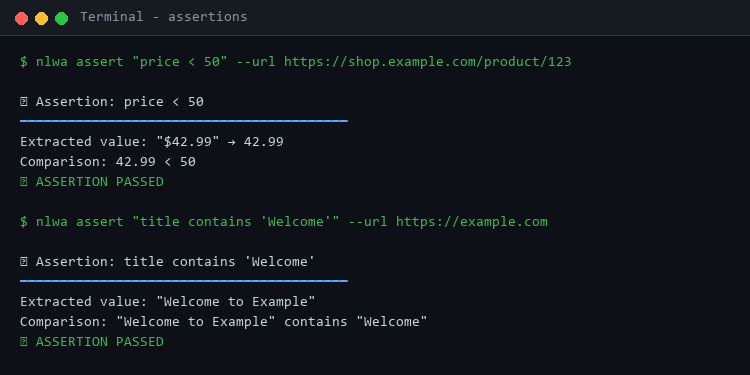

# NLWebAgent - Natural Language Web Testing Agent

A powerful web automation and testing tool that lets you control browsers using natural language. Powered by Playwright with AI-guided actions.

```
┌─────────────────────────────────────────────────────────────────────────┐
│                           NLWebAgent Workflow                           │
├─────────────────────────────────────────────────────────────────────────┤
│                                                                         │
│   ┌──────────┐    ┌──────────┐    ┌──────────┐    ┌──────────┐         │
│   │  You:    │    │  Agent:  │    │  Vision: │    │ Output:  │         │
│   │ "Login   │───▶│ Parse    │───▶│ See page │───▶│ Actions  │         │
│   │  and     │    │ intent   │    │ & decide │    │ executed │         │
│   │ search"  │    │          │    │          │    │          │         │
│   └──────────┘    └──────────┘    └──────────┘    └──────────┘         │
│                                                         │               │
│                                                         ▼               │
│                                              ┌─────────────────┐        │
│                                              │ ✅ Test results │        │
│                                              │ 📹 Video replay │        │
│                                              │ 📝 Playwright   │        │
│                                              │    codegen      │        │
│                                              └─────────────────┘        │
└─────────────────────────────────────────────────────────────────────────┘
```

## Features

| Feature | Description | CLI Example |
|---------|-------------|-------------|
| **Natural Language Testing** | Write tests in plain English | `nlwa test "Verify login shows dashboard"` |
| **Semantic Assertions** | Vision + extraction for semantic checks | `nlwa assert "price < 50" --url ...` |
| **Record → Codegen** | Record session, output Playwright test code | `nlwa record --url ... --output test.spec.ts` |
| **Self-Healing Selectors** | Auto-fallback to coordinates when selectors fail | Built-in (no CLI flag needed) |

## Installation

### Prerequisites

- Python 3.10+
- [Ollama](https://ollama.ai/) (optional, for local model)
- [Playwright](https://playwright.dev/python/) browsers

### Setup

```bash
# Clone the repository
git clone https://github.com/tanner-eischen/nlwebagent.git
cd nlwebagent

# Create virtual environment
python -m venv .venv
source .venv/bin/activate  # On Windows: .venv\Scripts\activate

# Install dependencies
pip install -e ".[dev]"

# Install Playwright browsers
playwright install chromium

# Download local model (optional)
ollama pull llama3.2-vision:11b
```

### Configuration

Create a `.env` file:

```bash
cp .env.example .env
```

Key configuration options:

| Variable | Default | Description |
|----------|---------|-------------|
| `USE_LOCAL_MODEL` | `true` | Use Ollama for local inference |
| `FALLBACK_TO_CLAUDE` | `true` | Fall back to Claude if local fails |
| `CLAUDE_API_KEY` | - | Anthropic API key for Claude |
| `OLLAMA_HOST` | `http://localhost:11434` | Ollama server URL |
| `HEADLESS` | `false` | Run browser in headless mode |
| `RECORD_VIDEO` | `true` | Record session videos |
| `ACTION_STRATEGY` | `selector_first` | Prefer selectors over coordinates |

## CLI Usage

### Run Automation Task

Execute a web automation task using natural language:

```bash
nlwa run --url https://example.com --task "Click the login button"
nlwa run --url https://shop.example.com --task "Add item to cart" --output ./results
```

Options:
- `--url, -u`: Starting URL (required)
- `--task, -t`: Task description in natural language (required)
- `--output, -o`: Output directory for artifacts (default: ./output)
- `--max-steps, -m`: Maximum number of steps (default: 20)
- `--headless, -h`: Run browser in headless mode

### Natural Language Testing

Write tests in plain English:

```bash
nlwa test "Verify user can login" --url https://example.com/login
nlwa test "Check search returns results" --url https://example.com --output ./test-results
```

The agent will:
1. Parse your test description
2. Execute actions to complete the test
3. Verify expected outcomes
4. Generate a test report with pass/fail status

### Semantic Assertions

Run assertions against web pages:

```bash
# Numeric comparisons
nlwa assert "price < 50" --url https://shop.example.com/product/123
nlwa assert "count >= 5" --url https://example.com/items

# String matching
nlwa assert "title contains 'Welcome'" --url https://example.com
nlwa assert "url starts with 'https'" --url https://example.com

# Visibility checks
nlwa assert "button is visible" --url https://example.com
nlwa assert "form is hidden" --selector "#login-form" --url https://example.com
```

Supported assertion types:
- Numeric: `<`, `<=`, `>`, `>=`, `==`
- String: `contains`, `starts with`, `ends with`, `equals`
- Visibility: `is visible`, `is hidden`
- Count: `count(.item) >= 3`

### Record → Codegen

Record a session and generate Playwright test code:

```bash
nlwa record --url https://example.com --output test.spec.ts
nlwa record --url https://example.com --task "Complete checkout" --output checkout.spec.ts
```

The generated test file includes:
- Full Playwright TypeScript code
- All recorded actions converted to Playwright commands
- Assertion suggestions based on extractions
- Comments for any actions that need manual review

## Show Me The Output

### CLI Overview



### Example: Running a Test



### Example: Record → Codegen



### Example: Semantic Assertions



### Example: Session Transcript

```json
{
  "session_id": "20240315_143022",
  "task": "Verify login shows dashboard",
  "status": "success",
  "steps_taken": 5,
  "actions": [
    {"step": 1, "action": "TYPE:#email:test@example.com", "model": "llama"},
    {"step": 2, "action": "TYPE:#password:********", "model": "llama"},
    {"step": 3, "action": "CLICK:button[type='submit']", "model": "llama"},
    {"step": 4, "action": "EXTRACT:h1.dashboard-title", "result": "Welcome Back"},
    {"step": 5, "action": "DONE", "model": "llama"}
  ],
  "artifacts": {
    "video": "./recordings/videos/20240315_143022.webm",
    "transcript": "./recordings/transcripts/20240315_143022_transcript.json",
    "screenshots": 5
  }
}
```

## Programmatic Usage

```python
import asyncio
from agent.orchestrator import WebAutomationAgent
from models.model_selector import ModelSelector
from browser.playwright_agent import BrowserController

async def main():
    model_selector = ModelSelector()
    browser = BrowserController()
    agent = WebAutomationAgent(
        model_selector=model_selector,
        browser=browser,
    )

    await agent.initialize()

    result = await agent.execute_task(
        task_description="Search for 'python playwright'",
        start_url="https://google.com",
        max_steps=20,
    )

    print(f"Status: {result['status']}")
    print(f"Steps: {result['steps_taken']}")

    await agent.close()

asyncio.run(main())
```

## Action Types

| Action | Format | Description |
|--------|--------|-------------|
| CLICK | `CLICK:selector` | Click element by selector |
| TYPE | `TYPE:selector:text` | Type text into element |
| EXTRACT | `EXTRACT:selector:attr` | Extract value from element |
| CLICK_AT | `CLICK_AT:x:y` | Click at coordinates (0-1 normalized) |
| TYPE_AT | `TYPE_AT:x:y:text` | Type at coordinates |
| NAVIGATE | `NAVIGATE:url` | Navigate to URL |
| SCROLL | `SCROLL:direction:amount` | Scroll page |
| WAIT | `WAIT:seconds` | Wait for duration |
| DONE | `DONE` | Mark task complete |
| ERROR | `ERROR:message` | Report error |

## Self-Healing Selectors

When selector-based actions fail, the agent automatically:
1. Detects selector errors
2. Uses vision model to find fallback coordinates
3. Retries the action at the identified location

This provides robustness against changing page layouts.

## Authentication

### Login Policies

Define domain-specific login policies in `auth/policies.py`:

```python
LOGIN_POLICIES = {
    "example.com": {
        "login_url": "https://example.com/login",
        "username_selector": "#email",
        "password_selector": "#password",
        "submit_selector": "button[type='submit']",
        "credential_key": "EXAMPLE",
    },
}
```

### Storage State

Browser state (cookies, localStorage) is automatically saved and reused:

- Saved to `STORAGE_STATE_PATH` on session close
- Reused when `REUSE_STORAGE_STATE=true`
- Avoids repeated logins during development

## Testing

```bash
# Run all tests
python -m pytest tests/ -v

# Run specific test categories
python -m pytest tests/test_action_parsing.py -v
python -m pytest tests/test_fixture_workflows.py -v

# Run with coverage
python -m pytest tests/ --cov=agent --cov=browser --cov=cli
```

## Project Structure

```
nlwebagent/
├── agent/
│   ├── actions.py        # Action types and parsing
│   └── orchestrator.py   # Main agent logic
├── browser/
│   └── playwright_agent.py  # Playwright browser controller
├── models/
│   ├── base_model.py     # AI model interface
│   ├── ollama_model.py   # Ollama integration
│   ├── claude_model.py   # Claude integration
│   └── model_selector.py # Model fallback logic
├── auth/
│   ├── manager.py        # Authentication manager
│   └── policies.py       # Login policies
├── cli/
│   ├── main.py           # CLI entry point
│   ├── commands/         # CLI commands
│   ├── codegen/          # Playwright code generator
│   └── assertions/       # Assertion parser/evaluator
├── tests/
│   ├── fixtures/         # HTML test fixtures
│   └── test_*.py         # Test files
└── config.py             # Configuration
```

## License

MIT License - see [LICENSE](LICENSE) for details.
